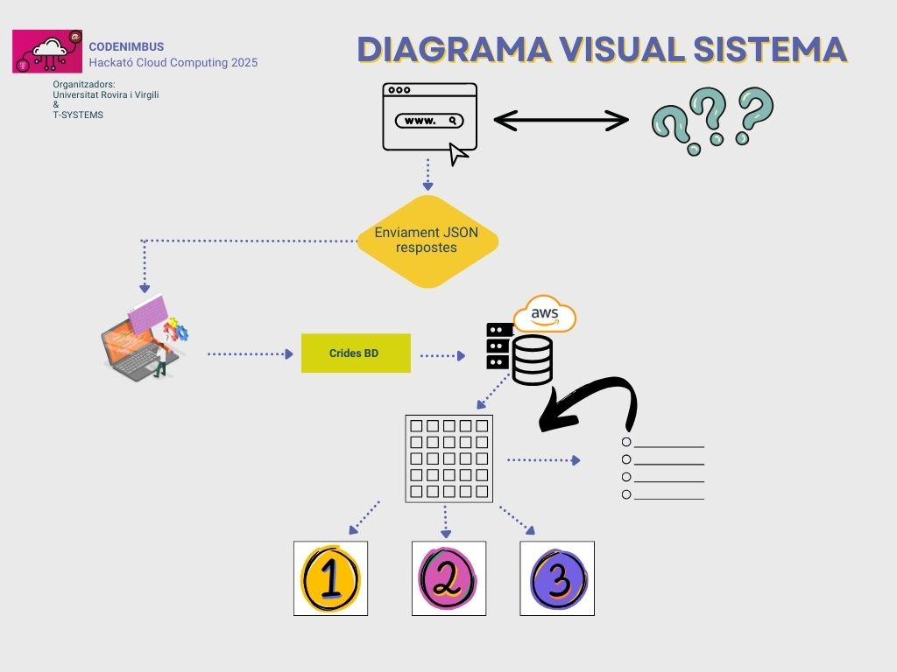
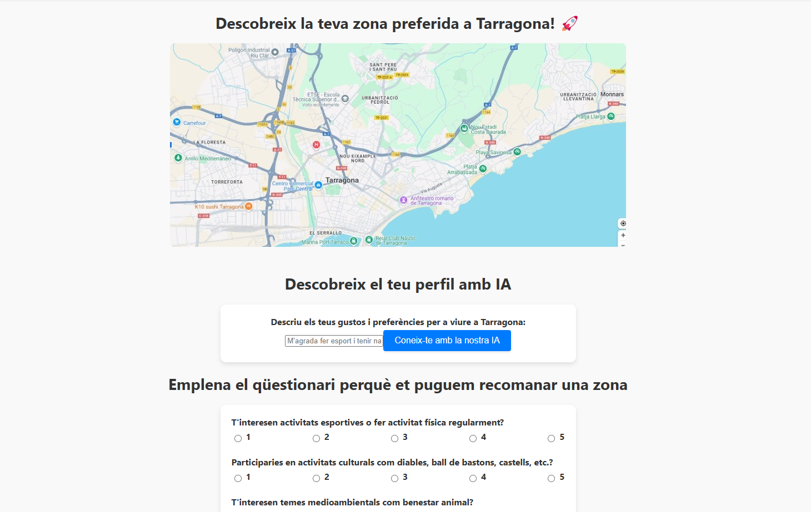
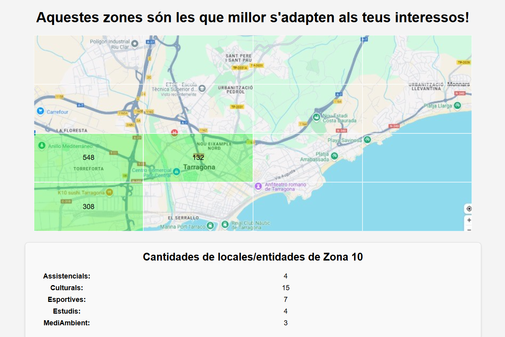

# 📌 SuitYu

SuitYu servei web capaç de representar, calcular i gestionar conjunt de dades per avaluar-les i fer recomanacions intel·ligents sobre el terreny de Tarragona.

## 👥 Equip CodeNimbus

### **Eric**

### **Hugo** 

### **Albert**

### **Pozo**  

## ❓ Problema abordat

Abordar la inquietud d'usuaris per trobar lloc per viure sense saber el que volen amb exactitud.

## 💡 La nostra solució

Disseny i implementació d'un servei web interactiu per l'usuari que mostra mapa Tarragoní i la capacitat de rebre recomanació geogràfica, per enquesta o per consulta a intel·ligència artificial.

## 🛠️ Tecnologies utilitzades

- Llenguatges de programació
    - Javascript, Python, MySQL
- Frameworks i llibreries  
    - React, Flask, mysql-connector, Amazon RDS
- Eines i plataformes
    - Visual Studio Code, Pycharm, AWS, DeepSeek

## ☁️ Sistema Implementat

## 🌍 Impacte del projecte

El projecte té un impacte ciutadà en el sentit que la web és interactiva per l'usuari, a més que pot generar recomanacions personalitzades als diferents usuaris. També és molt escalable com que si en un futur es volgués ponderar les recomanacions segons un nou paràmetre, es podria realitzar i donar respostes precises.
## 📸 Captures i/o demo del projecte

[Link a video]

## 🙌 Agraïments i conclusió

Agraïments als mentors ENRIQUE, GERMAN, GERARD i AITOR que han ajudat i donat feedback als constants dubtes que ens sorgien; també agrair al professorat que ens ha assistit durant l'esdeveniment i l'equip de càtering per proveir de constants àpats per no perdre energia.

Com a grup coincidim en el fet que el més important que ens portem d'aquesta experiència és el frenesí de treball grupal en un àmbit que no controlem massa dins d'un límit de temps ajustat.

Projecte desenvolupat com a part de la Hackató Cloud Computing 2025, per la Universitat Rovira i Virgili i T-Systems.